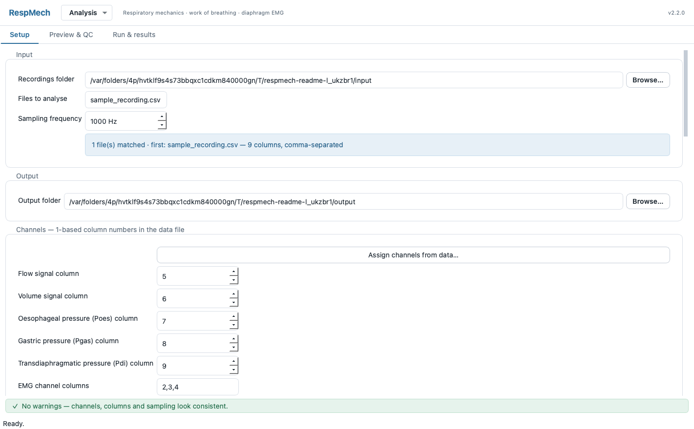
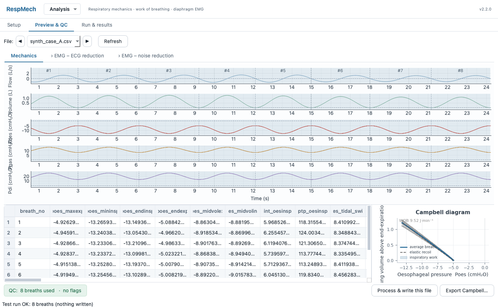
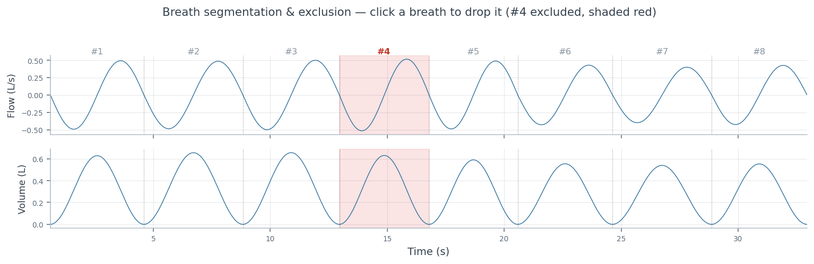
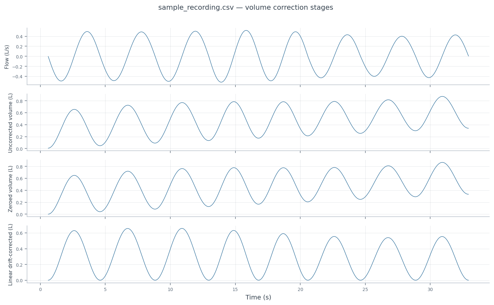
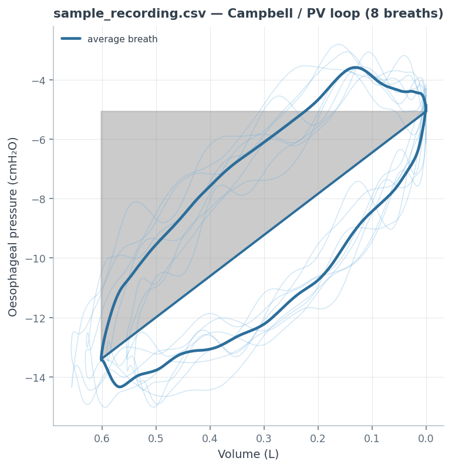
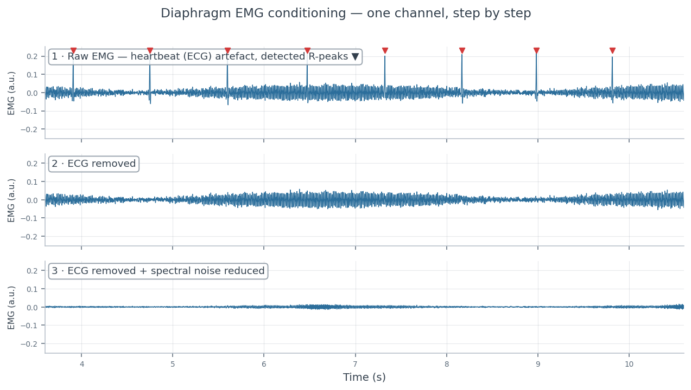
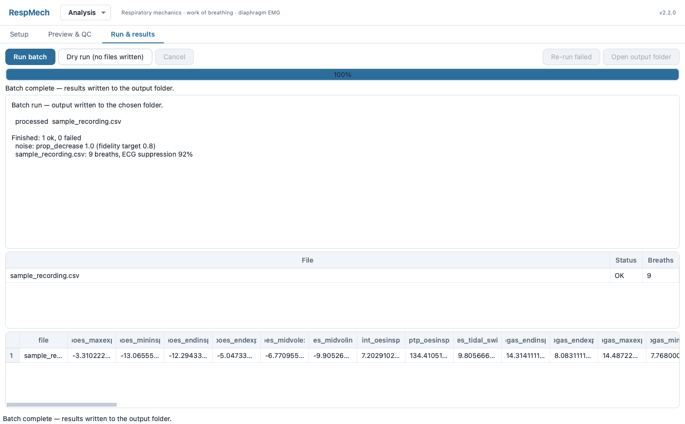

# RespMech — respiratory mechanics, work of breathing and diaphragm EMG

_(c) Copyright 2019–2026 Emil Schwarz Walsted (emilwalsted@gmail.com), ORCID [0000-0002-6640-7175](https://orcid.org/0000-0002-6640-7175)_

[](https://zenodo.org/badge/latestdoi/191052676)

RespMech analyses a time series of respiratory physiological recordings (e.g. exported from
LabChart) breath by breath, and calculates:

* **respiratory mechanics**
* **inspiratory and expiratory work of breathing** (Campbell diagram)
* **diaphragm EMG** — RMS envelope, ECG-artefact removal, spectral noise reduction
* **Sample Entropy**<sup>[1](#sampenref1),[2](#sampenref2)</sup> (e.g. of diaphragm EMG)

Version 2 is a desktop application with a guided setup, a live preview/QC screen and a batch
runner. The physiology is a faithful port of the original v1 code and is locked by
golden/characterisation tests — see [Correctness](#correctness).



---

## Install

**Recommended — the desktop app.** Download the installer for your platform from the
[latest release](https://github.com/emilwalsted/respmech/releases): a `.dmg` (macOS) or `.msi`
(Windows). It bundles its own Python — nothing else to install.

**From source** (developers, or to use the CLI):

```bash
git clone https://github.com/emilwalsted/respmech.git
cd respmech
pip install -e ".[dev,gui]"      # gui = PySide6 desktop app;  dev adds the test stack
respmech-gui                     # launch the desktop app
```

Extras: `gui` (desktop app), `emg` (librosa — spectral noise reduction), `plots` (matplotlib
diagnostic figures), `dev` (tests). See [docs/INSTALL.md](docs/INSTALL.md) for details.

## Using the app

```bash
respmech-gui
```

Three screens, in the order you work:

| Screen | What you do |
|---|---|
| **Setup** | Point at your recordings, map the data columns to channels, choose what to save. Assign channels visually from the data if you prefer. Settings validate as you type — the status bar flags anything inconsistent. |
| **Preview & QC** | See the analysis on one file *before* running the batch: breath segmentation, the Campbell loop and the per-breath table, and dedicated tabs to tune **EMG – ECG reduction** and **EMG – noise reduction** against the live signal. Click a breath to exclude it. |
| **Run & results** | Run the batch, watch progress per file, review the per-file status and averaged metrics, and open the output folder. |



Settings are stored as a declarative **TOML** *analysis* file (no longer an executable `.py`).
Open, save and switch between analyses — including your recently opened files — from the
**Analysis** menu in the header, which is available on every screen; RespMech marks unsaved
edits in the title bar and asks before discarding them.

## Command line

```bash
respmech run settings.toml            # process a batch  (--dry-run computes without writing)
respmech validate settings.toml       # check the settings and the input files
respmech migrate old_settings.py -o settings.toml   # convert a v1 settings file (runs no v1 code)
```

`migrate` prints a report of every field moved, renamed or dropped.

---

## Data recording requirements

Input data do *not* need to be a specific length, but because some outputs are per-time
(e.g. minute ventilation) you must specify the **sampling frequency** of the recording.

The code analyses data breath by breath, and it is imperative that the recording
**starts with the last part of an expiration and ends with the first part of an inspiration**.
The recording is trimmed automatically to start at exactly the first inspiration and end at
exactly the last expiration.

Breaths are segmented by joining an inspiration with the following expiration, using the **flow**
signal to find the transition. A *breath-separation buffer* absorbs "wobbly" flow around zero
(common in quiet breathing); its length depends on your sampling and breathing frequency. In
Preview & QC you can click any breath — e.g. an IC manoeuvre or a cough — to drop it from the
analysis:



**Flow and volume conventions.** The analysis assumes flow is **negative on inspiration** and
positive on expiration — invert it in Setup if your recording is the other way around. Volume
must be **inspired volume**; it can be inverted, or integrated from the flow signal if your
recording has no volume channel. **Volume drift** (common when integrating from flow) is
corrected automatically, with an optional trend adjustment on top — each breath's end-expiratory
volume should return to the same baseline, and when it creeps the correction pulls it back:



Supported input formats: **MATLAB**, **Excel**, **CSV/text**. (MATLAB files exported from the
Windows and macOS versions of LabChart differ — pick the variant in Setup ▸ Advanced.)

## Work of breathing

Two options: calculate WOB from each breath's Campbell diagram and average the results, or first
build an averaged pressure/volume loop and calculate WOB from that. The two give similar results,
but with irregular breaths the averaged loop is more robust. The number of resampling points used
when averaging the loop is configurable (a good default is the sampling frequency ÷ 8–10; it must
be lower than the shortest inspiration or expiration in the file).

<p align="center"></p>

The enclosed area of the oesophageal-pressure–volume loop is the inspiratory work of breathing:
the faint loops are the individual breaths, the bold one their average, the diagonal the passive
elastic-recoil line, and the shaded triangle the elastic component.

## Diaphragm EMG

When EMG channels are present, each is conditioned in steps before its RMS envelope and (optionally)
sample entropy are measured. The heartbeat (**ECG**) artefact is detected on the clearest channel
and subtracted, then **spectral noise reduction** — trained on a diaphragm-quiet reference — cleans
the residual noise floor while preserving the inspiratory burst. Both steps are tuned against the
live signal on the Preview screen's EMG tabs, and every stage is written to the diagnostic figures:



## Entropy

Sample Entropy is calculated per breath for the selected channels and averaged like the other
measurements. The embedding (*m*) and tolerance (*r*, multiplied by the SD of the data)
parameters are configurable in Setup ▸ Advanced.

_<a name="sampenref1">1</a>) Lozano-García M, Leonardo, Moxham J, Rafferty F., Torres A, Jolley CJ, Jané R. Assessment of Inspiratory Muscle Activation using Surface Diaphragm Mechanomyography and Crural Diaphragm Electromyography. doi:10.1109/EMBC.2018.8513046._

_<a name="sampenref2">2</a>) Aboy M, David, Austin D, Pau. Characterization of Sample Entropy in the Context of Biomedical Signal Analysis. 2007. doi:10.1109/IEMBS.2007.4353701._

---

## Output

Everything lands in the output folder you choose:

* **`data/`** — Excel workbooks: the across-file averages, and (optionally) breath-by-breath
  values per file, plus a cohort summary. Each workbook carries its own Units and Provenance
  sheets.
* **`diagnostics/`** — vector **PDF** figures per file: Campbell/PV loops (averaged and
  per breath), the analysed and raw signals, the staged volume correction, and per-channel
  EMG overviews at each conditioning stage (raw → ECG-removed → noise-reduced). Optionally the
  EMG channels as WAV.
* **`analysis-used.toml`** and **`run-report.txt`** — the exact settings and a log of what was
  read, kept, excluded and written, so a folder of results carries its own recipe.

Use the diagnostic figures (or the Preview screen) to spot breaths to exclude — e.g. IC
manoeuvres or coughs — then exclude them by clicking them in Preview.



## Correctness

The v2 engine is a port of the original v1 monolith. Golden/characterisation tests pin the
output byte-for-byte against references baked from the original implementation, which is kept
frozen in [`legacy/`](legacy/README.md) for exactly that purpose.

* How the calculations work (formulas and units): [docs/REVERSE_ENGINEERING.md](docs/REVERSE_ENGINEERING.md)
* Design and rationale: [docs/PLAN.md](docs/PLAN.md)
* The tests: [tests/golden/](tests/golden/)

---

# License and usage

This program is free software: you can redistribute it and/or modify it under the terms of the
GNU General Public License as published by the Free Software Foundation, either version 3 of the
License, or (at your option) any later version.

This program is distributed in the hope that it will be useful, but WITHOUT ANY WARRANTY; without
even the implied warranty of MERCHANTABILITY or FITNESS FOR A PARTICULAR PURPOSE. See the GNU
General Public License for more details.

[Read the entire licence here.](LICENSE)

Sample entropy is vendored from pyEntropy — see [`LICENSE pyentrp`](LICENSE%20pyentrp).

## Note to respiratory scientists

I created this code for my own work and shared it hoping that other researchers working with
respiratory physiology might find it useful. If you have questions or suggestions that would make
it more useful, please drop me an email.

### How do I cite this code in scientific papers – and should I?

It is up to you, really. Personally I am a fan of transparency and Open Source / Open Science and
I would appreciate a mention. This will also make readers of your papers aware that this code
exists – if you found it useful, perhaps they will too.

Every released version has its own DOI. Reference the latest via
[](https://zenodo.org/badge/latestdoi/191052676),
or cite a specific version using that version's DOI (click the badge for the list).

An example citation:

_[...] were calculated using the Python package RespMech (ES Walsted, RespMech v2.2, 2026, https://github.com/emilwalsted/respmech/, DOI: 10.5281/zenodo.3270826) [...]_
