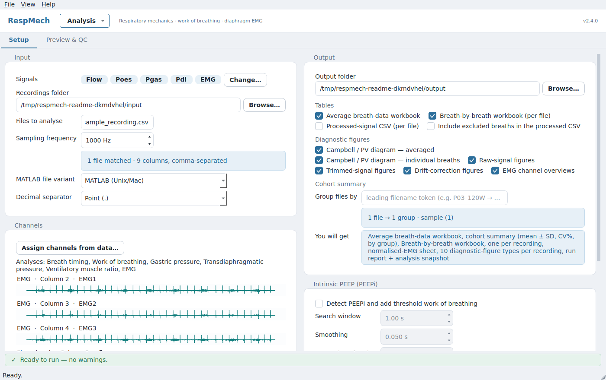
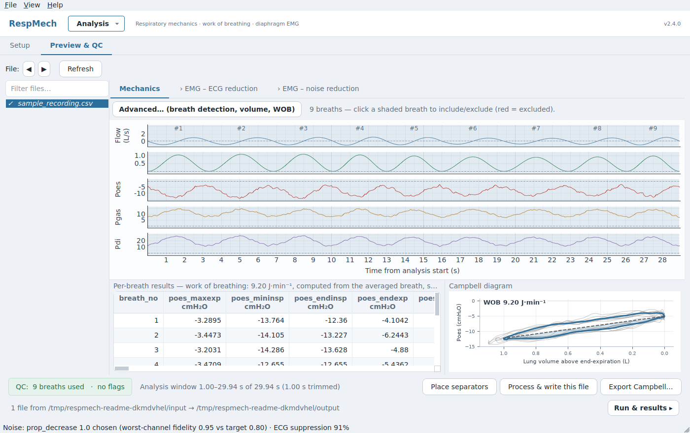
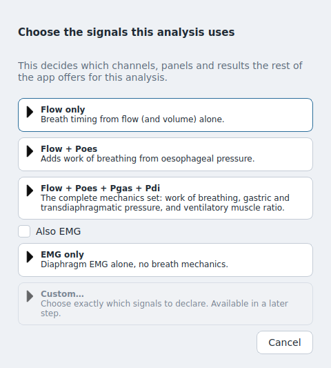
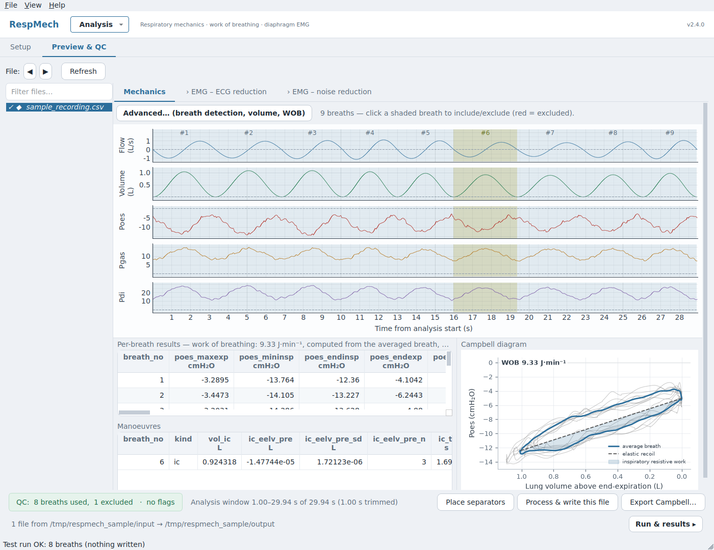
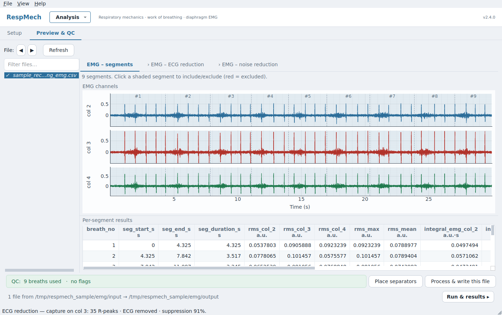
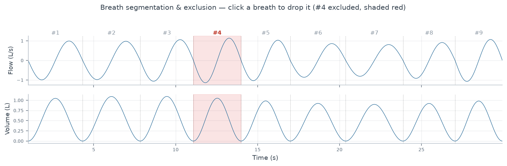
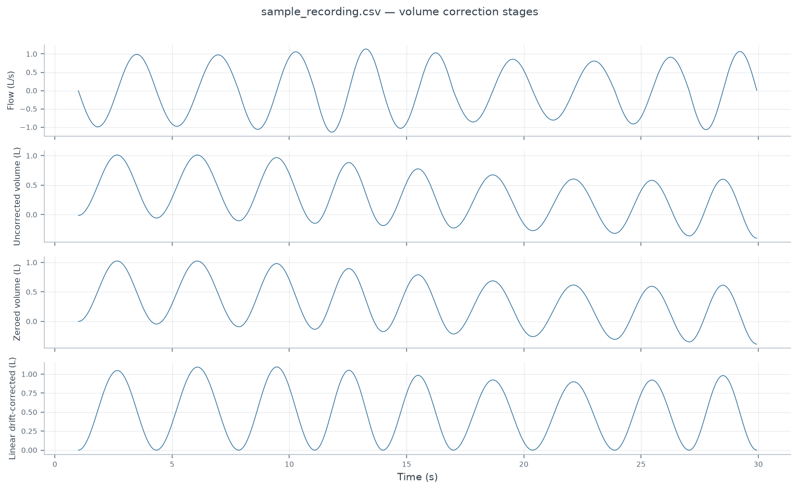
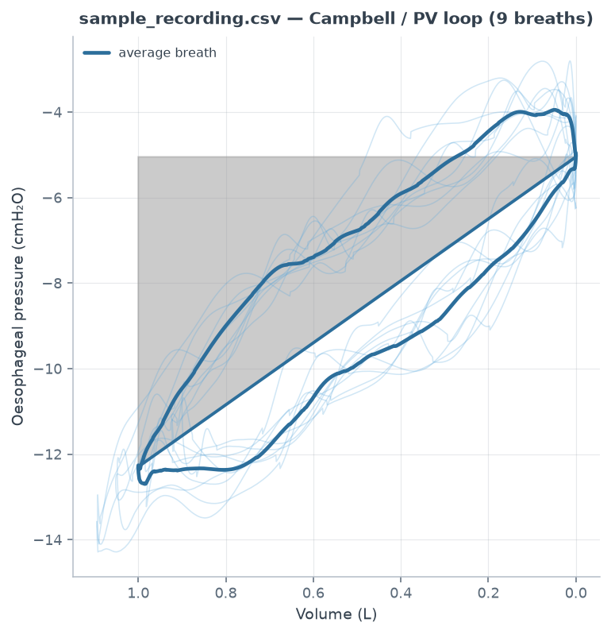
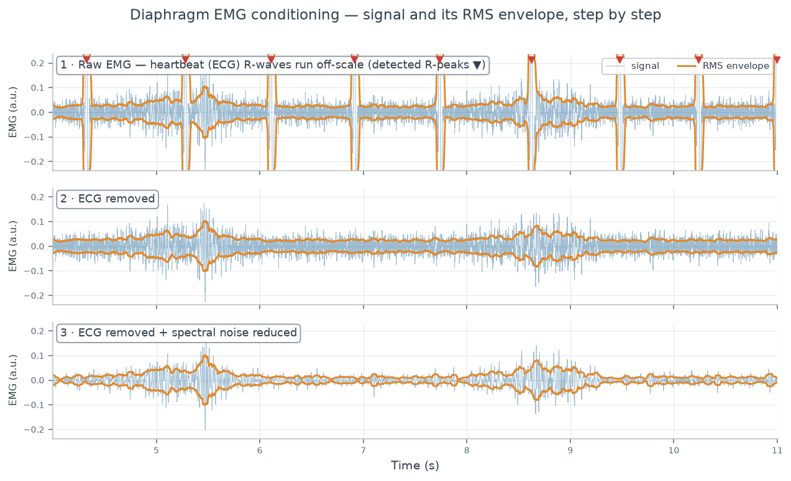
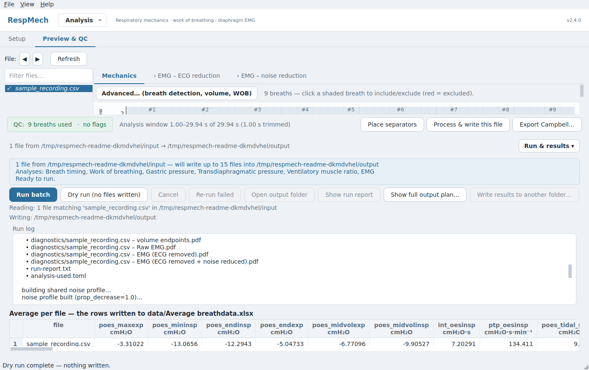

# RespMech — respiratory mechanics, work of breathing and diaphragm EMG

_(c) Copyright 2019–2026 Emil Ingerslev Walsted (emilwalsted@gmail.com), ORCID [0000-0002-6640-7175](https://orcid.org/0000-0002-6640-7175)_

[](https://zenodo.org/badge/latestdoi/191052676)

RespMech analyses a time series of respiratory physiological recordings (e.g. exported from
LabChart) breath by breath, and calculates:

* **respiratory mechanics**
* **inspiratory and expiratory work of breathing** (Campbell diagram)
* **diaphragm EMG** — RMS envelope, ECG-artefact removal, spectral noise reduction
* **Sample Entropy**<sup>[1](#sampenref1),[2](#sampenref2)</sup> (e.g. of diaphragm EMG)

Version 2 is a desktop application with a guided setup, a live preview/QC screen, and a batch
runner that opens as a drawer right where you're looking. The physiology is a faithful port of
the original v1 code and is locked by golden/characterisation tests — see
[Correctness](#correctness).



---

## Install

**Recommended — the desktop app.** Download the installer for your platform from the
[latest release](https://github.com/emilwalsted/respmech/releases): a `.dmg` (macOS) or `.msi`
(Windows). It bundles its own Python — nothing else to install.

**Python package** (CLI + core; the GUI is an extra):

```bash
pip install respmech            # command-line tool + analysis engine
pip install "respmech[gui]"     # + the PySide6 desktop app (respmech-gui)
```

**From source** (developers, or to use the CLI):

```bash
git clone https://github.com/emilwalsted/respmech.git
cd respmech
pip install -e ".[dev,gui]"      # gui = PySide6 desktop app;  dev adds the test stack
respmech-gui                     # launch the desktop app
```

Extras: `gui` (desktop app), `emg` (librosa — spectral noise reduction), `plots` (matplotlib
diagnostic figures), `dev` (tests). See [docs/INSTALL.md](docs/INSTALL.md) for details.

See [CHANGELOG.md](CHANGELOG.md) for what changed in each release.

## Using the app

```bash
respmech-gui
```

First time in? Choose **Explore with sample data** on the start screen to load a
ready-made synthetic recording — the one shown in the figures below, complete with a
heartbeat artefact on the EMG and a little volume drift, so every step has something to
demonstrate.

Two tabs:

| Tab | What you do |
|---|---|
| **Setup** | Point at your recordings, map the data columns to channels — RespMech suggests roles from the file's own column names, or assign them visually from the data if you prefer — and choose what to save. Settings validate as you type — the status bar flags anything inconsistent. |
| **Preview & QC** | See the analysis on one file *before* running the batch: breath segmentation, the Campbell loop and the per-breath table, and dedicated subtabs to tune **EMG – ECG reduction** and **EMG – noise reduction** against the live signal. Click a breath to exclude it. |

**Run & results** is a drawer, not a third tab: a compact "Run & results ▸" bar sits below Preview
& QC's file list on every subtab, and opens into the batch's progress, per-file status, averaged
metrics and output folder — it opens itself the moment you start a run, so you never have to
remember to check it.



Settings are stored as a declarative **TOML** *analysis* file (no longer an executable `.py`).
Open, save and switch between analyses — including your recently opened files — from the
**Analysis** menu in the header, which is available on every screen; RespMech marks unsaved
edits in the title bar and asks before discarding them. The same actions, plus keyboard
shortcuts, live in the window's **File** menu, alongside **View** (jump to a tab) and **Help**
(documentation, website, About).

## Command line

```bash
respmech run settings.toml            # process a batch  (--dry-run computes without writing)
respmech breaths settings.toml [FILE] # list every detected breath/segment (one file, or all matched)
respmech validate settings.toml       # check the settings and the input files
respmech migrate old_settings.py -o settings.toml   # convert a v1 settings file (runs no v1 code)
respmech init new_settings.toml --signals flow,poes,emg [--folder DIR --files MASK --fs 1000]
```

`breaths` numbers every breath (or, for an EMG-only signal set, segment) `respmech run`
would build for the given file(s), with its onset, duration, kind and whether it is
excluded from the tidal average — the same numbers a real run's output uses, so you can
check them before running. It also suggests which untyped breath looks like a forced
vital capacity manoeuvre (the longest untyped expiration in the file) and prints a
ready-to-paste `[[processing.breath_types]]` snippet for it.

`validate` also reports any reference/subject link that will not work once the batch's
real file list is known (a reference source not among the analysed files, a linked
breath that is excluded or mistyped, a group key matching no file) — advisory unless
`processing.lung_volume.require_references` is set and a reference source is genuinely
missing, which fails validation.

`run --dry-run` prints each file's resolved inspiratory-capacity and forced-vital-
capacity reference (`own` when the reference is the file's own typed breath, e.g.
`IC ref: own #4 · FVC ref: own #7`) whenever this analysis names an IC reference
anywhere, or `no IC reference — lung-volume columns NaN` for a file whose own reference
did not resolve.

`migrate` prints a report of every field moved, renamed, defaulted (not present in the
legacy file — e.g. an absent Pgas/Pdi channel, or the derived `analysis.signals`, which
the legacy format never had at all) or dropped.

`init` writes a commented starting TOML file with only the `[input.channels]` entries
your chosen signal set needs — e.g. `--signals flow,poes` omits Pgas/Pdi entirely.
`--folder`/`--files`/`--fs` are written as real values when given, or left as commented
placeholders you fill in by hand; `respmech validate` (see above) tells you what, if
anything, is still missing. `respmech validate` and the run report both name the signal
set an analysis actually uses and what it computes, e.g.:

```
Signals: flow, poes (derived) · Entropy: 3 columns · Analyses: Breath timing, Work of breathing, Sample entropy · off: Pgas/Pdi (not in signal set)
```

---

## Signal sets

Not every recording has every channel, so an analysis declares which **signals** it uses.
A new analysis starts with that choice, and everything after it (the channels Setup asks
for, the panels Preview & QC shows, the columns and figures a run writes) follows it:



| Signal set | What you get |
|---|---|
| **Flow only** | Breath timing, tidal volume and ventilation from flow (and volume). Preview shows a flow–volume loop where the Campbell diagram would be. |
| **Flow + Poes** | Adds work of breathing and the oesophageal-pressure descriptors. |
| **Flow + Poes + Pgas + Pdi** | The complete set, and the default: adds gastric and transdiaphragmatic pressure. |
| **… also EMG** | Any of the three above, plus the diaphragm-EMG analyses. |
| **EMG only** | No flow channel at all: see [EMG-only analyses](#emg-only-analyses). |

Sample entropy is available in every set once a column is assigned to it. A channel whose
role leaves the set is cleared when you change the set, never left assigned to something
the analysis no longer declares. The choice is stored as an optional `[analysis]` table
(`signals = ["flow", "poes"]`); left out, the set is worked out from whichever channels are
assigned, so an analysis written before signal sets existed behaves exactly as it did. A
run's output only contains the columns of the signals it used, and `respmech validate`,
the run report and each workbook's Provenance sheet name the set and what it computes.
*Explore with sample data* in the File menu opens a reduced sample recording when the
current analysis is Flow only or Flow + Poes (without EMG), an EMG-only sample when it is EMG only, and the
complete one otherwise.

## Breath types and reference manoeuvres

A plain click on a breath only **marks** it (green on the plots, in the table and in the loop diagram; click again to unmark). Not every breath in a file is tidal breathing. **Right-click** a breath in Preview & QC ▸
Mechanics (or Ctrl+left-click) and give it a type: *Tidal*, *Excluded*, *IC manoeuvre*,
*FVC manoeuvre*, *IC + FVC*, *Maximal inspiratory effort*, *Sniff* or *Other…*. A typed
breath is left out of the tidal averages exactly like an excluded one, and is measured
separately in a **Manoeuvres** table below the per-breath table and in its own sheet of the
file's workbook:



* An **IC manoeuvre** reports its inspiratory capacity (peak volume above the end-expiratory
  level of the tidal breaths just before it), timing, peak inspiratory flow and pressure
  swings, with quality flags for a low effort, an unstable baseline, a
  measurement that does not repeat and a manoeuvre at the edge of the recording.
* An **FVC manoeuvre** reports FVC, FEV₁ and FEV₁/FVC, PEF, the
  back-extrapolated volume and whether the forced expiration reached a genuine end
  (ATS/ERS 2019).
* A **maximal inspiratory effort** or **sniff** reports its own peak pressures and EMG, the
  reference [normalisation](#operating-lung-volumes-efl-and-peepi) uses.

The same choices are also available as controls on the toolbar row next to **Refresh**
(a type selector, *Use as IC reference for* and *Reference manoeuvres…*). They act on the
marked breath and stay disabled until one is marked.

A dedicated recording in which every breath is typed (a separate IC or FVC file) is
analysed too; its Manoeuvres table stands in for the breath-by-breath data.

**Where a reference comes from.** A file's IC, FVC, baseline-IC or maximal-effort reference
can be a typed breath in the same file or in a *different* one, so one IC recording can
serve all of a participant's exercise files. Right-click a breath typed as an IC manoeuvre and choose *Use as
IC reference for ▸ this file / all files of its group / all files*, or open *Reference
manoeuvres…* (also on a file's row in the file rail) for the full picker. In the settings
file the same choices are `[[processing.references]]` (one file) and
`[[processing.reference_defaults]]` (a group). The order is always: an explicit entry for
the file, then its group's entry, then the file's own typed breath. Per-participant
spirometry (`[[input.subjects]]`: TLC, VC, RV, FEV₁, MVV) applies to every file of that
participant, keyed like the cohort summary's groups (the leading filename token, or
`output.group_regex`). An unresolved link is never a hard error: it is a caution in
`respmech validate`, blank values and a note in the run report, unless
`processing.lung_volume.require_references` is set.

`respmech breaths settings.toml [FILE]` lists every breath with its number, onset, duration
and type, and suggests the untyped breath with the longest expiration as a forced vital capacity
candidate, with a ready-to-paste `[[processing.breath_types]]` snippet.

If the automatic detector splits one breath in two (a flow wobble) or merges two (a flat
expiration), repair it by hand in Preview & QC ▸ Mechanics: click a trace to **cut** a new
boundary there, or click an existing boundary to **join** it away (switch on *Place separators* first, or a click excludes the breath). This corrects the
automatic segmentation; an analysis with no repair is unaffected.

## EMG-only analyses

A recording with no flow channel, such as a maximal inspiratory or expiratory manoeuvre
recorded on the EMG alone, has no inspiration or expiration to find. Choose **EMG only** in
the signal-set picker and say how each recording is cut into **segments**, the units RMS,
integrated EMG and sample entropy are computed on:

* **One maximal manoeuvre**: the whole file is one segment.
* **Several efforts or breaths**: mark the boundaries yourself in
  Preview & QC ▸ **EMG – segments** (click to place, click near a separator to remove it;
  exclusions and types follow a segment through a renumbering).
* **Tidal breathing — detect bursts automatically**: each file is cut at the onset of every
  burst of inspiratory EMG activity, found on the envelope of the ECG-removed signal (a
  threshold with hysteresis and a minimum burst and gap length, after Hodges & Bui 1996).
  Each segment then reports the neural timing of its own cycle (`ti_emg`, `te_emg`,
  `ttot_emg`, `bf_emg`), and a recording without a clear burst fails with a named error
  instead of being cut into noise. In the settings file, `method = "fixed_windows"` cuts
  equal windows instead.



The burst thresholds are starting values that have been checked on synthetic recordings
only: look at the shaded segments before trusting them on real ones. The noise reference for
spectral noise reduction can be the periods between the bursts, or a segment you typed
*Rest*. With `whole_file`, each EMG channel also reports where the file's peak fell and the
mean of its three highest envelope values, a steadier peak level than the single maximum
(which can land on a heartbeat when ECG removal is off). *Explore with sample data* opens an
EMG-only sample, already split into its own breaths, when the current analysis is EMG only.

## Operating lung volumes, EFL and PEEPi

Typed manoeuvres feed four optional analyses. All are **off or blank until their inputs
exist**, and they only *add* columns.

**Operating lung volumes.** Once a file has a resolved IC reference, every tidal breath
reports its operating IC, EELV, EILV and inspiratory reserve volume, as a volume above
residual volume (from the participant's vital capacity in `[[input.subjects]]`) and, when a
TLC is entered, as an absolute value as well. The IC is by default held constant across the
file (the usual reporting convention). `processing.lung_volume.ic.eelv_tracking =
"within_file"` lets it move with the breath's own end-expiratory volume, which shows
dynamic hyperinflation; it needs the IC reference to be in the same file, and is left
blank when volume trend correction is on. The change in IC
and EELV against a baseline recording is reported per file. The run report has a
*LUNG VOLUMES* block naming the datum used.

**MFVL, expiratory flow limitation and ventilatory capacity.** A file with a typed FVC
breath places every tidal flow–volume loop inside that file's own maximal flow–volume curve:
how much of the tidal expiration reaches the flow the maximal curve allows (expiratory flow
limitation, as a percentage and a yes/no), the fastest the breath could have been exhaled,
and the ventilatory capacity and breathing reserve that implies (against a supplied MVV or
FEV₁ × 40). This placement uses the file's own typed breaths only (a reference in another
file is not used for it), and without an IC manoeuvre in the same file the
placement-dependent columns are blank. Preview & QC shows the figure whenever the previewed file has a typed FVC breath,
and a run writes `flow-volume (tidal in MFVL).pdf`.

**PEEPi and the modified Campbell diagram.** `processing.pressure.peepi` measures
intrinsic PEEP for every breath from the oesophageal-pressure deflection before inspiratory
flow starts, and reports the extra work that threshold adds in new columns beside the
existing ones (`peepi_dyn`, `wob_in_thr`, `wobtotal_thr` and the pressure–time products
including it), drawn as a hatched rectangle on the Campbell diagram. The four detection
thresholds are starting values that have not yet been measured on real recordings: treat
small deflections with caution.

**Normalisation to a maximal manoeuvre.** `processing.pressure.normalization` expresses
tidal inspiratory oesophageal and transdiaphragmatic pressure, and EMG, as a percentage of
the same person's typed maximal inspiratory effort or sniff, and adds the tension–time
indices `tt_es` and `tt_di` and, with EMG, the neural respiratory drive index `nrdi`, on a
"Pressure normalised" sheet. The run report and Provenance sheet name the reference, and
whether it was a sniff or a maximal inspiration, since those give different diaphragm
pressures.

Each of these is described formula by formula, with its known limits, in
[docs/REVERSE_ENGINEERING.md](docs/REVERSE_ENGINEERING.md) (§5.11–5.17, all marked v2-only,
with no counterpart in RespMech 1.x). A commented example of every settings table is in
[examples/settings.toml](examples/settings.toml).

---

## Data recording requirements

Input data do *not* need to be a specific length, but because some outputs are per-time
(e.g. minute ventilation) you must specify the **sampling frequency** of the recording.

The code analyses data breath by breath, and it is imperative that the recording
**starts with the last part of an expiration and ends with the first part of an inspiration**.
The recording is trimmed automatically to start at exactly the first inspiration and end at
exactly the last expiration.

Breaths are segmented by joining an inspiration with the following expiration, using the **flow**
signal to find the transition. A *breath-separation buffer* absorbs "wobbly" flow around zero
(common in quiet breathing); its length depends on your sampling and breathing frequency. In
Preview & QC you can click any breath — e.g. an IC manoeuvre or a cough — to drop it from the
analysis:



**Flow and volume conventions.** The analysis assumes flow is **negative on inspiration** and
positive on expiration — invert it in Setup if your recording is the other way around. Volume
must be **inspired volume**; it can be inverted, or integrated from the flow signal if your
recording has no volume channel. **Volume drift** (common when integrating from flow) is
corrected automatically, with an optional trend adjustment on top — each breath's end-expiratory
volume should return to the same baseline, and when it creeps the correction pulls it back. The
trend adjustment anchors on the end-expiratory trough of each breath; which troughs count is
judged **relative to each recording's own volume range**, so it needs no tuning at any tidal
volume (Preview & QC → Mechanics → Advanced… if a recording does need it):



Supported input formats: **MATLAB**, **Excel**, **CSV/text**. (MATLAB files exported from the
Windows and macOS versions of LabChart differ — pick the variant in Setup ▸ Advanced.)

## Work of breathing

Two options: calculate WOB from each breath's Campbell diagram and average the results, or first
build an averaged pressure/volume loop and calculate WOB from that. The two give similar results,
but with irregular breaths the averaged loop is more robust. The number of resampling points used
when averaging the loop is configurable (a good default is the sampling frequency ÷ 8–10; it must
be lower than the shortest inspiration or expiration in the file).

<p align="center"></p>

The Campbell diagram shows the inspiratory work of breathing: the faint loops are the individual
breaths, the bold one their average, the diagonal the elastic-recoil line joining end-expiration to
end-inspiration, and the shaded triangle the elastic component; the resistive component is the
bulge of the trace away from that line. The loop's own enclosed area is not the work of breathing.

## Diaphragm EMG

When EMG channels are present, each is conditioned in steps before its RMS envelope and (optionally)
sample entropy are measured. The heartbeat (**ECG**) R-wave is typically *several times* the EMG
amplitude, so if left in it dominates the signal and badly inflates the RMS — it is detected on the
clearest channel and subtracted first. Then **spectral noise reduction** — trained on a
diaphragm-quiet reference — cleans the residual noise floor while preserving the inspiratory burst.
Both steps are tuned against the live signal on the Preview screen's EMG tabs, and every stage is
written to the diagnostic figures. The bold envelope below is the **RMS** the analysis actually
measures: the raw one is dominated by the heartbeat (the R-waves run off the shared scale), and
removing the ECG then reducing the noise drops the between-breath floor while keeping the bursts —
the signal-to-noise of the inspiratory pattern roughly doubles from step 2 to step 3:



## Entropy

Sample Entropy is calculated per breath for the selected channels and averaged like the other
measurements, in Setup's "Sample entropy" card (shown once a channel is assigned to Entropy in
the channel picker). The two settings there are named after what they literally are, not after
the neighbouring textbook parameter: **Template length (m + 1)** is one more than the embedding
dimension *m* used in the sample-entropy literature — the app's default of 3 gives *m* = 2, the
value conventional there (set 2 for the *m* = 1 RespMech reported before this default changed).
**Tolerance (r), × SD** is a multiple of the per-column standard deviation, not an absolute
tolerance — published values are typically 0.1-0.25 × SD, with 0.2 × SD the most widely used
default (Richman & Moorman, *Am J Physiol Heart Circ Physiol* 2000;278:H2039-49; Yentes et al.,
*Ann Biomed Eng* 2013;41:349-65); RespMech defaults to the lower end, 0.1 × SD. A read-out under
the two fields states the resulting *m* and *r* in those terms, and the same wording is recorded
in each output workbook's Provenance sheet whenever entropy is actually computed. Because both
*m* and *r* affect the value, and *r* is rescaled per segment against that segment's own standard
deviation, entropy values are only comparable across files and channels that share a sampling
frequency (and resampling setting) and the same *m* and *r*.

When the volume column is one of the entropy columns, its sample entropy is computed on
the volume RespMech itself analyses (zeroed, and drift- and trend-corrected as configured),
just as an EMG column is measured on the processed EMG. If volume is integrated from flow
and has no column of its own, tick **Entropy on derived volume** in the same card
(`input.channels.entropy_derived = ["volume"]`) to get the same three columns. Analyses
written before this rule show a notice once when they are opened, since their volume-column
entropy values change.

_<a name="sampenref1">1</a>) Lozano-García M, Sarlabous L, Moxham J, Rafferty GF, Torres A, Jolley CJ, Jané R. Assessment of inspiratory muscle activation using surface diaphragm mechanomyography and crural diaphragm electromyography. Annu Int Conf IEEE Eng Med Biol Soc. 2018;2018:3342-3345. doi:10.1109/EMBC.2018.8513046._

_<a name="sampenref2">2</a>) Aboy M, Cuesta-Frau D, Austin D, Micó-Tormos P. Characterization of sample entropy in the context of biomedical signal analysis. Annu Int Conf IEEE Eng Med Biol Soc. 2007;2007:5943-5946. doi:10.1109/IEMBS.2007.4353701._

---

## Output

Everything lands in the output folder you choose:

* **`data/`** — Excel workbooks: the across-file averages, and (optionally) breath-by-breath
  values per file, plus a cohort summary. Each workbook carries its own Units and Provenance
  sheets.
* **`diagnostics/`** — vector **PDF** figures per file: Campbell/PV loops (averaged and
  per breath), the analysed and raw signals, the staged volume correction, and per-channel
  EMG overviews at each conditioning stage (raw → ECG-removed → noise-reduced). Optionally the
  EMG channels as WAV.
* **`analysis-used.toml`** and **`run-report.txt`** — the exact settings and a log of what was
  read, kept, excluded and written, so a folder of results carries its own recipe.

Use the diagnostic figures (or the Preview screen) to spot breaths to exclude — e.g. IC
manoeuvres or coughs — then exclude them by clicking them in Preview.



## Correctness

The v2 engine is a port of the original v1 monolith. Golden/characterisation tests pin breath
timing, volumes, ventilation, the pressure descriptors and the elastic work-of-breathing
component byte-for-byte against references baked from the original implementation, which is
kept frozen in [`legacy/`](legacy/README.md) for exactly that purpose. Two deliberate
deviations from 1.x, and a further SciPy-driven drift in the Simpson-integrated columns (a
library version difference, not a RespMech choice), are instead pinned to within 1 part in
10⁹ (rtol 1e-9, atol 1e-12) — see [Changes from RespMech
1.x](https://respmech.dk/documentation.html#changes-from-1x).

* How the calculations work (formulas and units): [docs/REVERSE_ENGINEERING.md](docs/REVERSE_ENGINEERING.md)
* Design and rationale: [docs/PLAN.md](docs/PLAN.md)
* The tests: [tests/golden/](tests/golden/)

---

# License and usage

This program is free software: you can redistribute it and/or modify it under the terms of the
GNU General Public License as published by the Free Software Foundation, either version 3 of the
License, or (at your option) any later version.

This program is distributed in the hope that it will be useful, but WITHOUT ANY WARRANTY; without
even the implied warranty of MERCHANTABILITY or FITNESS FOR A PARTICULAR PURPOSE. See the GNU
General Public License for more details.

[Read the entire licence here.](LICENSE)

Sample entropy is vendored from pyEntropy — see [`LICENSE pyentrp`](LICENSE%20pyentrp).

## Note to respiratory scientists

I created this code for my own work and shared it hoping that other researchers working with
respiratory physiology might find it useful. If you have questions or suggestions that would make
it more useful, please drop me an email.

### How do I cite this code in scientific papers – and should I?

It is up to you, really. Personally I am a fan of transparency and Open Source / Open Science and
I would appreciate a mention. This will also make readers of your papers aware that this code
exists – if you found it useful, perhaps they will too.

Every released version has its own DOI. Reference the latest via
[](https://zenodo.org/badge/latestdoi/191052676),
or cite a specific version using that version's DOI (click the badge for the list). See
[CHANGELOG.md](CHANGELOG.md) for what changed between versions.

An example citation:

_[...] were calculated using the Python package RespMech (E Walsted, RespMech v2.4.0, 2026, https://github.com/emilwalsted/respmech/, DOI: 10.5281/zenodo.3270825) [...]_
